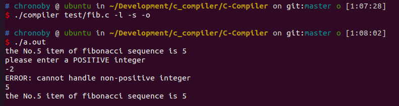
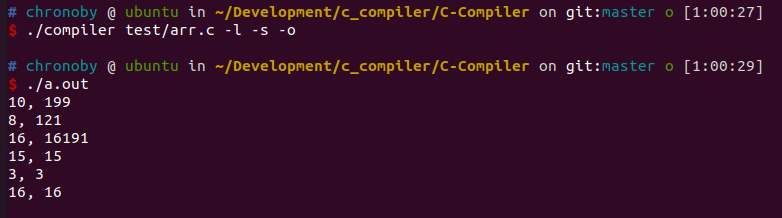
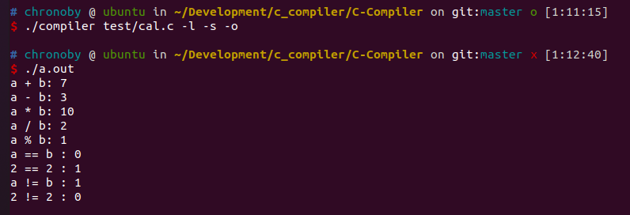
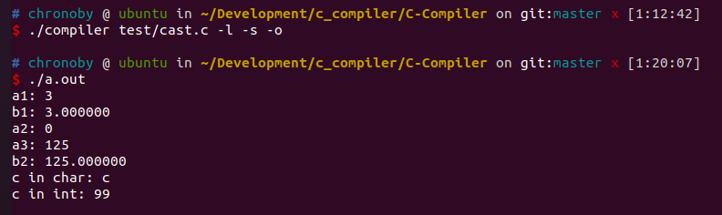
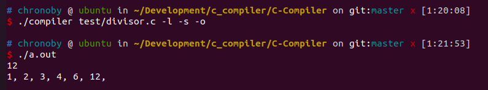
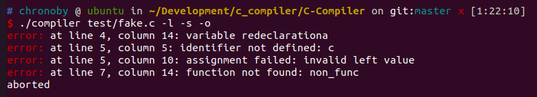
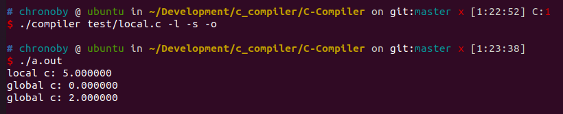
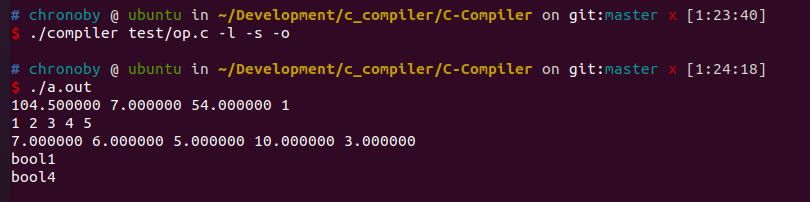
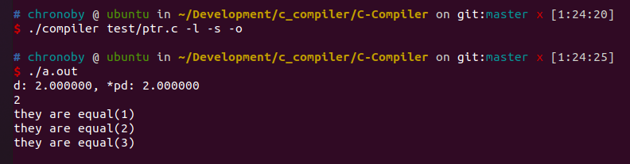

# 报告模板
# 1. 简介

本次实验中，我们设计了一个Linux环境下的类C语言编译器。我们的编译器以ANSI C语法为标准，实现了C语言的部分语法特性，包括但不限于函数、数组、指针、全局与局部变量、数值与逻辑运算，条件与循环语句等功能。

我们的编译器使用C++语言进行开发，并借助了lex，bison以及llvm工具。我们依照语法分析的规则，设计了AST的节点类，并利用这些节点类在语法分析的过程中构造出AST。同时，我们使用访问者模式的设计方法，设计出了Visitor类，通过对AST进行遍历来生成中间代码（llvm IR）。中间代码可借助其他工具进一步生成汇编代码与可执行文件，并在Linux平台上运行。

在语义分析和代码生成过程中，我们可以对代码中的错误进行定位和报错；同时，我们还借助pyecharts等工具，对生成的AST进行可视化操作。

## 1.1 语言特性

我们的编译器支持的语言特性如下：

### 数据类型
- `char`
- `short`
- `long`
- `int`
- `float`
- `double`
- `string (char*)` 
### 运算符
#### 双目
- `+` `-`
- `*` `/` `%`
- `==` `!=` `<` `>` `<=` `>=`
- `&&` `||`
#### 单目
- `*` `&`
- `~` `!`
- `[]`
- `++` `--`

### 功能
- 支持生成llvm IR, 汇编代码和可执行程序； 
- 全局变量和局部变量的声明，初始化与读写，一行可同时声明多个变量；
- 支持八进制和十六进制整数； 
- 支持指针，多级指针和指针下标访问； 
- 全局和局部的一维数组的声明，读写与初始化； 
- 函数定义和调用，支持递归； 
- printf和scanf的调用；
- 运算操作数检查，和隐式的操作数类型转换； 
- 显式类型转换（cast），支持一般数据类型和指针类型 
- if-else语句；
- while循环与continue语句和break语句； 
- 处理注释； 
- 报错的处理，可以显示错误的位置和类型；

### 注意事项
- 一个函数中变量声明必须放在函数的开始部分；
- 当一个函数在if语句中return时，结尾必须也有return（返回类型为void的函数除外）；
- 数组的大小必须在声明时显式地规定；

## 1.2 编译与运行
在Linux环境下，在工程目录下运行命令：
```
make
```
即可对项目进行编译。编译完成后，运行编译器的命令格式为：
```
./compiler <FILENAME> [options]
```
其中，<FILE_NAME>为待编译的的代码文件，[options]为命令行选项参数，包括：
* -l \<FILE\> 将llvm IR代码保存到\<FILE\>文件中；\<FILE\>默认值为a.ll；
* -s \<FILE\> 生成汇编代码，并保存到\<FILE\>文件中；\<FILE\>默认值为a.s；
* -o \<FILE\> 生成目标文件，并保存到\<FILE\>文件中；\<FILE\>默认值为a.out；

运行：
```
./compiler -h
```
或
```
./compiler --help
```
可显示帮助信息。

# 2. 词法分析 & 语法分析
# 3. 语义分析

## 3.1 符号表与符号表栈

## 3.2 变量的读写

## 3.3 数据类型检查与转换

## 3.4 错误检查

# 4. 代码生成

我们编译器的代码生成部分借助了 LLVM 工具。具体步骤为：

- 编写每一个 AST 节点的 codegen 函数，在合适位置用 LLVM C++ API 插入 LLVM IR 的指令，以生成 LLVM IR 文件(.ll)
- 用 llc 工具将 LLVM IR 转化为对应环境上的汇编代码(.s)
- 汇编代码即可使用 gcc 编译为对应环境上的可执行文件并运行

## 4.1 访问者模式(Visitor pattern)

我们的中间代码生成过程运用了被广泛使用的访问者模式。访问者模式是一种将数据操作和数据结构分离的设计模式。在代码生成过程中，AST 的结构比较稳定，但经常需要在 AST 的类中定义新的 codegen 操作。使用访问者模式可以避免添加的操作意外地改变这些类，同时将稳定的数据结构(AST)和异变的操作(codegen)解耦合，这样以后需要增加新的 codegen 操作只需新增访问者，而不需要改变现有逻辑。

本项目中访问者模式的实现方式如下：

- ast.h
```cpp
class AstNode
{
public:
    virtual std::shared_ptr<Variable> codegen(Visitor& visitor);
private:
    // ...
};
```

- ast.cpp

```cpp
std::shared_ptr<Variable> AstNode::codegen(Visitor& visitor)
{
    return visitor.codegen(*this);
}
```

- visitor.h

```cpp
class Visitor
{
public:
    virtual std::shared_ptr<Variable> codegen(const AstNode& node);
    // ...
};
```

- visitor.cpp

```cpp
std::shared_ptr<Variable> Visitor::codegen(const AstNode& node)
{
    // implementation
}
```

## 4.2 声明和初始化

## 4.3 运算符

LLVM 提供了丰富的运算符指令，如 add, sub, mul, sdiv, logical_and, logical_or等，可以直接将操作数 codegen 操作得到的值作为参数得到相应的指令。在插入每个运算符之前，我们首先对操作数进行了类型检查和必要的类型转换。以 `+` 运算符为例

```cpp
std::shared_ptr<Variable> Visitor::codegen(const AstAdditiveExpr& node)
{

    llvm::Value* res;
    auto lhs = node.add_expr->codegen(*this)->value;
    auto rhs = node.multi_expr->codegen(*this)->value;
    auto cast_res = type_check(lhs, rhs);
    if(cast_res == CastRes::INT)
    {
        res = this->builder->CreateAdd(lhs, rhs, "add");
    }
    else if(cast_res == CastRes::FLOAT)
    {
        res = this->builder->CreateFAdd(lhs, rhs, "fadd");
    }
    else if(cast_res == CastRes::WRONG)
    {
        node.errorMsg("unable to do implict cast between these types");
        this->error = 1;
        return nullptr;
    }
    else
    {
        // true?
        // unknown type
        return nullptr;
    }
```

## 4.4 条件分支和循环

条件分支和循环主要通过代码块的标签(label)和跳转指令(br)来实现。

- if-else 条件分支

if-else分支需要三个 basicblock，分别为 then，else，ifcont。if 条件分支则只需在 if-else 的基础上去掉 else block，在此不再赘述。

```cpp
std::shared_ptr<Variable> Visitor::codegen(const AstSelectionStmt& node)
{
    llvm::Function* parent_function = builder->GetInsertBlock()->getParent();

    llvm::BasicBlock* true_block = llvm::BasicBlock::Create(*context, "then", parent_function);
    llvm::BasicBlock* false_block = llvm::BasicBlock::Create(*context, "else");
    llvm::BasicBlock* merge_block = llvm::BasicBlock::Create(*context, "ifcont");

    builder->CreateCondBr(cond, true_block, false_block);

    // then block
    builder->SetInsertPoint(true_block);
    auto true_class = node.stmt1->codegen(*this);
    llvm::Value* true_value = nullptr;
    if(true_class)
    {
        true_value = true_class->value;
    }
    builder->CreateBr(merge_block);
    true_block = builder->GetInsertBlock();

    // else block
    parent_function->getBasicBlockList().push_back(false_block);
    builder->SetInsertPoint(false_block);

    llvm::Value* false_value = nullptr;
    auto false_class = node.stmt2->codegen(*this);
    if(false_class)
    {
        false_value = false_class->value;
    }
    builder->CreateBr(merge_block);

    false_block = builder->GetInsertBlock();
    parent_function->getBasicBlockList().push_back(merge_block);
    builder->SetInsertPoint(merge_block);
    return false_class;
}
```

- while 循环

while 循环与 if 条件分支语句类似，需要三个 basicblock，分别为 loop，loopin，loopcont，实现正确的跳转即可

```cpp
std::shared_ptr<Variable> Visitor::codegen(const AstIterStmt& node)
{
    llvm::Function* parent_function = builder->GetInsertBlock()->getParent();
    llvm::BasicBlock *pre_block = builder->GetInsertBlock();
    llvm::BasicBlock* loop_block = llvm::BasicBlock::Create(*context, "loop", parent_function);
    llvm::BasicBlock* true_block = llvm::BasicBlock::Create(*context, "loopin", parent_function);
    llvm::BasicBlock* cont_block = llvm::BasicBlock::Create(*context, "loopcont");
    tmp_loop_block = loop_block;
    tmp_cont_block = cont_block;

    builder->CreateBr(loop_block);
    builder->SetInsertPoint(loop_block);
    
    auto cond = node.expr->codegen(*this)->value;
    if(!cond)
    {
        return nullptr;
    }
    builder->CreateCondBr(cond, true_block, cont_block);

    // then block
    builder->SetInsertPoint(true_block);
    
    auto true_class = node.stmt->codegen(*this);
    llvm::Value* true_value = nullptr;
    if(true_class)
    {
        true_value = true_class->value;
    }
    builder->CreateBr(loop_block);

    // cont block
    parent_function->getBasicBlockList().push_back(cont_block);
    builder->SetInsertPoint(cont_block);
    tmp_loop_block = nullptr;
    tmp_cont_block = nullptr;
    return true_class;
}
```

- break 和 continue

break，即跳转至 cont_block, continue，跳转至 loop_block.
为了使 break 和 continue 语句的 codegen 函数可以访问到上述两个标签，添加 visitor 的成员变量，用来保存当前循环的 loop_block 和 cont_block。这两个成员需要在进入函数和退出函数时进行相应的赋值操作来打到正确的效果

```cpp
llvm::BasicBlock* tmp_loop_block;
llvm::BasicBlock* tmp_cont_block;
```


## 4.5 函数

## 4.6 指针

## 4.7 数组

- 数组声明

数组的 LLVM 类型可通过 `llvm::ArrayType::get(var_type, num);` 获得，全局变量数组和局部变量数组分别调用 `llvm::GlobalVariable` 和 `builder->CreateAlloca` 即可创建数组类型

- 数组初始化

数组的 initializer 可通过函数 `llvm::ConstantArray::get(llvm::dyn_cast<llvm::ArrayType>(var_type), values)` 来获得。
对于全局数组，initializer 可作为 `llvm::GlobalVariable` 的一个参数直接进行初始化；而对于局部数组，可调用 `builder->CreateStore` 进行赋值从而实现初始化

- 数组访问

调用 `builder->CreateGEP` 获得数组任意元素的指针，调用 `builder->CreateStore` 和 `builder->CreateLoad` 即可进行读写。

# 5. 可视化
# 6. 测试

我们的测试包含 9 个测试样例，对编译器的各个特性进行了测试

注：第一个样例包含了所有的源文件、中间代码、汇编、运行结果，后续样例省略中间代码和汇编

## 6.1 fib.c

- 涉及的特性： 含参的函数，全局和局部变量, 整数运算，递归，输入输出，注释, if-else, while, logical-or, break

- 源代码：

```c
int fib(int x)
{
    if (x == 1 || x == 2) 
    {
        return 1;
    }
    else
    {
        return fib(x - 1) + fib(x - 2);
    }
    return 0;
}

int a = 5;

int main()
{
    int b = -2;
    printf("the No.%d item of fibonacci sequence is %d\n", a, fib(a));
    printf("please enter a POSITIVE integer\n");
    while (b < 0)
    {
        scanf("%d", &b);
        if (b > 0)
        {
            break;
        }
        else
        {
            printf("ERROR: cannot handle non-positive integer\n");
        }
    }
    printf("the No.%d item of fibonacci sequence is %d\n", b, fib(b));

    return 0;
}
```

- LLVM IR

```
; ModuleID = 'main'
source_filename = "main"

@a = global i32 5
@0 = private unnamed_addr constant [44 x i8] c"the No.%d item of fibonacci sequence is %d\0A\00", align 1
@1 = private unnamed_addr constant [33 x i8] c"please enter a POSITIVE integer\0A\00", align 1
@2 = private unnamed_addr constant [3 x i8] c"%d\00", align 1
@3 = private unnamed_addr constant [43 x i8] c"ERROR: cannot handle non-positive integer\0A\00", align 1
@4 = private unnamed_addr constant [44 x i8] c"the No.%d item of fibonacci sequence is %d\0A\00", align 1

define i32 @fib(i32 %0) {
entry:
  %eq = icmp eq i32 %0, 2
  %eq1 = icmp eq i32 %0, 1
  %logical_or = select i1 %eq1, i1 true, i1 %eq
  br i1 %logical_or, label %then, label %else

then:                                             ; preds = %entry
  ret i32 1

else:                                             ; preds = %entry
  %sub = sub i32 %0, 1
  %1 = call i32 @fib(i32 %sub)
  %sub2 = sub i32 %0, 2
  %2 = call i32 @fib(i32 %sub2)
  %add = add i32 %1, %2
  ret i32 %add

ifcont:                                           ; preds = <badref>, <badref>
  ret i32 0
}

define i32 @main() {
entry:
  %b = alloca i32, align 4
  store i32 -2, i32* %b, align 4
  %0 = load i32, i32* @a, align 4
  %1 = load i32, i32* @a, align 4
  %2 = call i32 @fib(i32 %1)
  %printf_call = call i32 (i8*, ...) @printf(i8* getelementptr inbounds ([44 x i8], [44 x i8]* @0, i32 0, i32 0), i32 %0, i32 %2)
  %printf_call1 = call i32 (i8*, ...) @printf(i8* getelementptr inbounds ([33 x i8], [33 x i8]* @1, i32 0, i32 0))
  br label %loop

loop:                                             ; preds = %ifcont, %entry
  %3 = load i32, i32* %b, align 4
  %lt = icmp slt i32 %3, 0
  br i1 %lt, label %loopin, label %loopcont

loopin:                                           ; preds = %loop
  %4 = load i32, i32* %b, align 4
  %scanf_call = call i32 (i8*, ...) @scanf(i8* getelementptr inbounds ([3 x i8], [3 x i8]* @2, i32 0, i32 0), i32* %b)
  %5 = load i32, i32* %b, align 4
  %gt = icmp sgt i32 %5, 0
  br i1 %gt, label %then, label %else

then:                                             ; preds = %loopin
  br label %loopcont

else:                                             ; preds = %loopin
  %printf_call2 = call i32 (i8*, ...) @printf(i8* getelementptr inbounds ([43 x i8], [43 x i8]* @3, i32 0, i32 0))
  br label %ifcont

ifcont:                                           ; preds = %else, <badref>
  br label %loop

loopcont:                                         ; preds = %then, %loop
  %6 = load i32, i32* %b, align 4
  %7 = load i32, i32* %b, align 4
  %8 = call i32 @fib(i32 %7)
  %printf_call3 = call i32 (i8*, ...) @printf(i8* getelementptr inbounds ([44 x i8], [44 x i8]* @4, i32 0, i32 0), i32 %6, i32 %8)
  ret i32 0
}

declare i32 @printf(i8*, ...)

declare i32 @scanf(i8*, ...)
```

- 汇编

```asm
	.text
	.file	"main"
	.globl	fib                             # -- Begin function fib
	.p2align	4, 0x90
	.type	fib,@function
fib:                                    # @fib
	.cfi_startproc
# %bb.0:                                # %entry
	pushq	%rbp
	.cfi_def_cfa_offset 16
	pushq	%rbx
	.cfi_def_cfa_offset 24
	pushq	%rax
	.cfi_def_cfa_offset 32
	.cfi_offset %rbx, -24
	.cfi_offset %rbp, -16
	cmpl	$1, %edi
	je	.LBB0_2
# %bb.1:                                # %entry
	movl	%edi, %ebx
	cmpl	$2, %edi
	je	.LBB0_2
# %bb.4:                                # %else
	leal	-1(%rbx), %edi
	callq	fib@PLT
	movl	%eax, %ebp
	addl	$-2, %ebx
	movl	%ebx, %edi
	callq	fib@PLT
	addl	%ebp, %eax
	jmp	.LBB0_3
.LBB0_2:                                # %then
	movl	$1, %eax
.LBB0_3:                                # %then
	addq	$8, %rsp
	.cfi_def_cfa_offset 24
	popq	%rbx
	.cfi_def_cfa_offset 16
	popq	%rbp
	.cfi_def_cfa_offset 8
	retq
.Lfunc_end0:
	.size	fib, .Lfunc_end0-fib
	.cfi_endproc
                                        # -- End function
	.globl	main                            # -- Begin function main
	.p2align	4, 0x90
	.type	main,@function
main:                                   # @main
	.cfi_startproc
# %bb.0:                                # %entry
	pushq	%rbx
	.cfi_def_cfa_offset 16
	subq	$16, %rsp
	.cfi_def_cfa_offset 32
	.cfi_offset %rbx, -16
	movl	$-2, 12(%rsp)
	movq	a@GOTPCREL(%rip), %rax
	movl	(%rax), %ebx
	movl	%ebx, %edi
	callq	fib@PLT
	movl	$.L__unnamed_1, %edi
	movl	%ebx, %esi
	movl	%eax, %edx
	xorl	%eax, %eax
	callq	printf@PLT
	movl	$.L__unnamed_2, %edi
	xorl	%eax, %eax
	callq	printf@PLT
	leaq	12(%rsp), %rbx
	cmpl	$0, 12(%rsp)
	jns	.LBB1_4
	.p2align	4, 0x90
.LBB1_2:                                # %loopin
                                        # =>This Inner Loop Header: Depth=1
	movl	$.L__unnamed_3, %edi
	movq	%rbx, %rsi
	xorl	%eax, %eax
	callq	scanf@PLT
	cmpl	$0, 12(%rsp)
	jg	.LBB1_4
# %bb.3:                                # %else
                                        #   in Loop: Header=BB1_2 Depth=1
	movl	$.L__unnamed_4, %edi
	xorl	%eax, %eax
	callq	printf@PLT
	cmpl	$0, 12(%rsp)
	js	.LBB1_2
.LBB1_4:                                # %loopcont
	movl	12(%rsp), %ebx
	movl	%ebx, %edi
	callq	fib@PLT
	movl	$.L__unnamed_5, %edi
	movl	%ebx, %esi
	movl	%eax, %edx
	xorl	%eax, %eax
	callq	printf@PLT
	xorl	%eax, %eax
	addq	$16, %rsp
	.cfi_def_cfa_offset 16
	popq	%rbx
	.cfi_def_cfa_offset 8
	retq
.Lfunc_end1:
	.size	main, .Lfunc_end1-main
	.cfi_endproc
                                        # -- End function
	.type	a,@object                       # @a
	.data
	.globl	a
	.p2align	2
a:
	.long	5                               # 0x5
	.size	a, 4

	.type	.L__unnamed_1,@object           # @0
	.section	.rodata.str1.1,"aMS",@progbits,1
.L__unnamed_1:
	.asciz	"the No.%d item of fibonacci sequence is %d\n"
	.size	.L__unnamed_1, 44

	.type	.L__unnamed_2,@object           # @1
.L__unnamed_2:
	.asciz	"please enter a POSITIVE integer\n"
	.size	.L__unnamed_2, 33

	.type	.L__unnamed_3,@object           # @2
.L__unnamed_3:
	.asciz	"%d"
	.size	.L__unnamed_3, 3

	.type	.L__unnamed_4,@object           # @3
.L__unnamed_4:
	.asciz	"ERROR: cannot handle non-positive integer\n"
	.size	.L__unnamed_4, 43

	.type	.L__unnamed_5,@object           # @4
.L__unnamed_5:
	.asciz	"the No.%d item of fibonacci sequence is %d\n"
	.size	.L__unnamed_5, 44

	.section	".note.GNU-stack","",@progbits

```

- 运行结果



## 6.2 arr.c

- 涉及的特性： 八进制，十六进制，全局、局部数组的声明、初始化、读写、全局变量声明，++，--

- 源代码：

```c
int arr1[3] = {10, 010, 0x10}, i;

int main()
{
    int arr2[3] = {199, 0171, 0x3F3F};
    
    while (i < 3)
    {
        printf("%d, ", arr1[i++]);
        printf("%d\n", arr2[--i]);
        ++i;
        i--;
        ++i;
    }

    arr2[0] = 15;
    arr2[1] = i;
    arr2[2] = arr1[2];

    i = 0;
    while (i < 3)
    {
        arr1[i] = arr2[i];
        printf("%d, ", arr1[i]);
        printf("%d\n", arr2[i++]);
    }

    return 0;
}
```

- 运行结果



## 6.3 cal.c

- 涉及的特性：运算

- 源代码

```c
int main()
{
    int a = 5, b = 2;
    printf("a + b: %d\n", a + b);
    printf("a - b: %d\n", a - b);
    printf("a * b: %d\n", a * b);
    printf("a / b: %d\n", a / b);
    printf("a % b: %d\n", a % b);
    printf("a == b : %d\n", a == b);
    printf("2 == 2 : %d\n", 2 == 2);
    printf("a != b : %d\n", a != b);
    printf("2 != 2 : %d\n", 2 != 2);

    return 0;
}
```

- 运行结果



## 6.4 cast.c

- 涉及的特性：隐式、显式cast，指针和数组

- 源代码

```c
int main()
{
    int a = 3., *pa;
    double b;
    double* pb;
    char c, *pc;

    printf("a1: %d\n", a);

    b = a;
    printf("b1: %f\n", b);

    a = 3e-5;
    printf("a2: %d\n", a);

    a = 1.251e+2;
    printf("a3: %d\n", a);
    b = (double)a;
    printf("b2: %f\n", b);

    c = 'c';
    pc = &c;
    pa = (int*)pc;
    pc = (char*)pa;
    printf("c in char: %c\n", *pa);
    printf("c in int: %d\n", *pc);

    return 0; 
}
```

- 运行结果



## 6.5 divisor.c

- 涉及的特性：求因数

- 源代码

```c
void divisor(int c)
{
    int i = 1;
    while (i <= c)
    {
        if (c % i != 0)
        {
            i++;
            continue;
        } else {
            printf("%d, ", i);
        }
        i++; 
    }
    printf("\n");
}

int main()
{
    int x;
    scanf("%d", &x);
    divisor(x);

    return 0;
}
```

- 运行结果



## 6.6 fake.c

- 涉及的特性：错误处理

- 源代码

```c
int main()
{
    int a = 5;
    int a = 2;
    c = 3;
    
    non_func();
    return 0;
}
```

- 运行结果



## 6.7 local.c

- 涉及的特性：函数调用，变量作用域

- 源代码

```c
double c;

void setC()
{
    c = 2;
}

void echoC()
{
    printf("global c: %f\n", c);
}

int main()
{
    double c;
    c = 5;
    printf("local c: %f\n", c);
    
    echoC();
    setC();
    echoC();

    return 0;
}
```

- 运行结果



## 6.8 op.c

- 涉及的特性：运算符类型检查，隐式类型转换,报错

- 源代码

```c
int arr1[5] = {1, 2, 3, 4, 5};

int main()
{
    char a = 'a';
    short b = 2;
    int c = 3;
    int d = 012;
    int e = 0x12;
    float f = 3.0;
    double g = 7.5;
    double arr2[8] = {7.0, 6.0, 5.0, 4.0, 3.0, 2.0, 1.0, 0.};
    double h = a + g;
    double i = d - c;
    double j = e * f;
    int k = d % c;

    // int k = f % c; // error!
    arr2[3] = 10.0;
    
    printf("%lf %lf %lf %d\n", h, i, j, k);
    printf("%d %d %d %d %d\n", arr1[0], arr1[1], arr1[2], arr1[3], arr1[4]);
    printf("%lf %lf %lf %lf %lf\n", arr2[0], arr2[1], arr2[2], arr2[3], arr2[4]);
    if(k == 1)
        printf("bool1\n");
    if(k != 1)
        printf("bool2\n");
    if(k > 2)
        printf("bool3\n");
    if(k == 1 || c != 3)
        printf("bool4\n");
    
    return 0;
}
```

- 运行结果



## 6.9 ptr.c

- 涉及的特性：double，指针，多级指针，指针下标，隐式cast，变量声明和初始化, if

- 源代码

```c
int main()
{
    double c = 1, d = 2, *pc = &c, **ppc, *pd = &d;
    double ***pppc;

    int d_ = d;

    ppc = &pc;
    pppc = &ppc;

    printf("d: %f, *pd: %f\n", d, *pd);
    printf("%d\n", d_);

    if (&(**pppc) == ppc)
    {
        printf("they are equal(1)\n");
    }

    if (*(&(**pppc)) == *ppc)
    {
        printf("they are equal(2)\n");
    }

    if (pppc[0][0] == pc)
    {
        printf("they are equal(3)\n");
    }

    return 0;
}
```

- 运行结果



# 7. 分工