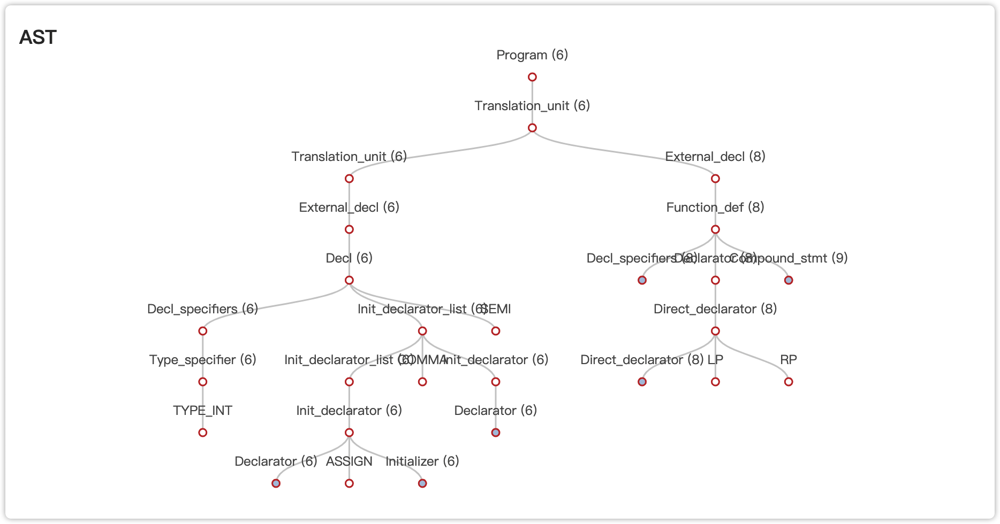

# 报告模板
# 1. 简介

本次实验中，我们设计了一个Linux环境下的类C语言编译器。我们的编译器以ANSI C语法为标准，实现了C语言的部分语法特性，包括但不限于函数、数组、指针、全局与局部变量、数值与逻辑运算，条件与循环语句等功能。

我们的编译器使用C++语言进行开发，并借助了lex，bison以及llvm工具。我们依照语法分析的规则，设计了AST的节点类，并利用这些节点类在语法分析的过程中构造出AST。同时，我们使用访问者模式的设计方法，设计出了Visitor类，通过对AST进行遍历来生成中间代码（llvm IR）。中间代码可借助其他工具进一步生成汇编代码与可执行文件，并在Linux平台上运行。

在语义分析和代码生成过程中，我们可以对代码中的错误进行定位和报错；同时，我们还借助pyecharts等工具，对生成的AST进行可视化操作。

## 1.1 语言特性

我们的编译器支持的语言特性如下：

### 数据类型
- `char`
- `short`
- `long`
- `int`
- `float`
- `double`
- `string (char*)` 
### 运算符
#### 双目
- `+` `-`
- `*` `/` `%`
- `==` `!=` `<` `>` `<=` `>=`
- `&&` `||`
#### 单目
- `*` `&`
- `~` `!`
- `[]`
- `++` `--`

### 功能
- 支持生成llvm IR, 汇编代码和可执行程序； 
- 全局变量和局部变量的声明，初始化与读写，一行可同时声明多个变量；
- 支持八进制和十六进制整数； 
- 支持指针，多级指针和指针下标访问； 
- 全局和局部的一维数组的声明，读写与初始化； 
- 函数定义和调用，支持递归； 
- printf和scanf的调用；
- 运算操作数检查，和隐式的操作数类型转换； 
- 显式类型转换（cast），支持一般数据类型和指针类型 
- if-else语句；
- while循环与continue语句和break语句； 
- 处理注释； 
- 报错的处理，可以显示错误的位置和类型；

### 注意事项
- 一个函数中变量声明必须放在函数的开始部分；
- 当一个函数在if语句中return时，结尾必须也有return（返回类型为void的函数除外）；
- 数组的大小必须在声明时显式地规定；

## 1.2 编译与运行
在Linux环境下，在工程目录下运行命令：
```
make
```
即可对项目进行编译。编译完成后，运行编译器的命令格式为：
```
./compiler <FILENAME> [options]
```
其中，<FILE_NAME>为待编译的的代码文件，[options]为命令行选项参数，包括：
* -l \<FILE\> 将llvm IR代码保存到\<FILE\>文件中；\<FILE\>默认值为a.ll；
* -s \<FILE\> 生成汇编代码，并保存到\<FILE\>文件中；\<FILE\>默认值为a.s；
* -o \<FILE\> 生成目标文件，并保存到\<FILE\>文件中；\<FILE\>默认值为a.out；

运行：
```
./compiler -h
```
或
```
./compiler --help
```
可显示帮助信息。
# 2、 词法分析&语法分析

## 2.1 工具

在本项目中，使用Lex进行词法分析，具体代码请参考scanner文件夹下的scanner.l文件，使用Yacc进行语法分析，具体代码请参考parser文件夹下的parser.y文件。

同时，本项目所使用的正则表达式和文法规则主要参考Jeff Lee于1985年发布的ANSI C grammer。参考链接：http://www.lysator.liu.se/c/ANSI-C-grammar-l.html

## 2.2 词法分析

词法分析的目标是将文件的输入字符序列转换为token序列，具体规则如下所示：

### 2.2.1 注释

```
<INITIAL>"/*"               {BEGIN COMMENT;}
<COMMENT>"*/"               {BEGIN INITIAL;}
<COMMENT>.                  {;}
<COMMENT>\n                 {yycolumn = 1;}
<INITIAL>"//"               {BEGIN COMMENT2;}
<COMMENT2>\n                {yycolumn = 1; BEGIN INITIAL;}
<COMMENT2>.                 {;}
```

本项目共支持两种形式的注释，分别为/\*……\*/和//……。当检测到/\*后，表明遇到了第一种注释形式，此时程序将进入读入注释的模式，直到读入\*/。当检测到//后，表明遇到了第二种注释形式，测试程序将进入读入注释的模式，直到读入一个换行符。

### 2.2.2 语言关键字

```
<INITIAL>{VOID}                      SAVE_TOKEN; return VOID;  				//"void"
<INITIAL>{TYPE_INT}		     SAVE_TOKEN; return TYPE_INT;  			//"int"
<INITIAL>{TYPE_LONG}                 SAVE_TOKEN; return TYPE_LONG;			//"long"
<INITIAL>{TYPE_SHORT}                SAVE_TOKEN; return TYPE_SHORT;			//"short"
<INITIAL>{TYPE_DOUBLE}               SAVE_TOKEN; return TYPE_DOUBLE;			//"double"
<INITIAL>{TYPE_FLOAT}                SAVE_TOKEN; return TYPE_FLOAT;			//"float"
<INITIAL>{TYPE_SIGNED}               SAVE_TOKEN; return TYPE_SIGNED;			//"signed"
<INITIAL>{TYPE_UNSIGNED}             SAVE_TOKEN; return TYPE_UNSIGNED;			//"unsigned"
<INITIAL>{TYPE_CHAR}                 SAVE_TOKEN; return TYPE_CHAR;			//"char"
<INITIAL>{IF}                        SAVE_TOKEN; return IF;				//"if"
<INITIAL>{ELSE}                      SAVE_TOKEN; return ELSE;				//"else"
<INITIAL>{WHILE}                     SAVE_TOKEN; return WHILE;				//"while"
<INITIAL>{CONTINUE}                  SAVE_TOKEN; return CONTINUE;			//"continue"
<INITIAL>{BREAK}                     SAVE_TOKEN; return BREAK;				//"break"
<INITIAL>{SIZEOF}                    SAVE_TOKEN; return SIZEOF;				//"sizeof"
<INITIAL>{RETURN}                    SAVE_TOKEN; return RETURN;				//"return"
```

语言关键字主要包括数据类型和一些语句中所需要的关键字。每个token所对应的正则表达式请参考每行最后一列的注释。

本项目支持的数据类型主要有以下几种：void、int、long、short、double、floag、signed、unsigned、char。

本项目支持的特殊语句类型主要有以下几种：if-else语句、while语句、continue/break语句、return语句。

SAVE_TOKEN为一个宏定义，其目的是通过建立一个string类保存匹配到的文本和其长度，其定义如下所示

```c++
#define SAVE_TOKEN yylval.string = new std::string(yytext, yyleng)
```

### 2.2.3 语言专用符号

```
<INITIAL>{PTR_OP}                    return PTR_OP;				//"->"
<INITIAL>{INC_OP}                    return INC_OP;				//"++"
<INITIAL>{DEC_OP}                    return DEC_OP;				//"--"
<INITIAL>{AND_OP}                    return AND_OP;				//"&&"
<INITIAL>{OR_OP}                     return OR_OP;				//"||"
<INITIAL>{EQ_OP}                     return EQ_OP;				//"=="
<INITIAL>{NE_OP}                     return NE_OP;				//"!="
<INITIAL>{LE_OP}                     return LE_OP;				//"<="
<INITIAL>{GE_OP}                     return GE_OP;				//">="

<INITIAL>{AND}                       return('&');				//"&"
<INITIAL>{ASSIGN}                    return('=');				//"="
<INITIAL>{PLUS}                      return('+');				//"+"
<INITIAL>{MINUS}                     return('-');				//"-"
<INITIAL>{MULTI}                     return('*');				//"*"
<INITIAL>{DIV}                       return('/');				//"/"
<INITIAL>{MOD}                       return('%');				//"%"
<INITIAL>{SEMI}                      return(';');				//";"
<INITIAL>{LP}                        return('(');				//"("
<INITIAL>{RP}                        {return(')');}				//")"
<INITIAL>{LB}                        return('{');				//"{"
<INITIAL>{RB}                        return('}');				//"}"
<INITIAL>{LF}                        return('[');				//"["
<INITIAL>{RF}                        return(']');				//"]"
<INITIAL>{DOT}                       return '.';				//"."
<INITIAL>{COMMA}                     return ',';				//","
<INITIAL>{LESS}                      return '<';				//"<"
<INITIAL>{GREATER}                   return '>';				//">"
<INITIAL>{NOT}                       return '!';				//"!"
<INITIAL>{ELLIPSIS}                  return ELLIPSIS;				//"..."
```

每个token所对应的正则表达式请参考每行最后一列的注释。

### 2.2.4 语言标示符和数据格式

首先需要介绍一些正则表达式的定义，如下所示

```
IDENTIFIER  [a-zA-Z_][a-zA-Z0-9_]*

DIGIT       [0-9]
EXP         [Ee][+-]+{DIGIT}+
INT_S       (u|U|l|L)*
FLOAT_S     (f|F|l|L)
INTEGER     (0|[1-9][0-9]*){INT_S}?
HEXI        (0(x|X))({DIGIT}|[A-Fa-f])+{INT_S}?
OCTAL       (0[0-7]+){INT_S}?
FLOAT       (({DIGIT}+{EXP})|({DIGIT}*"."{DIGIT}+({EXP})?)|({DIGIT}+"."{DIGIT}*({EXP})?)){FLOAT_S}?
CHAR        '(\\.|[^\\'])+'
STRING      \"(\\.|[^\\"])*\"
```

IDENTIFIER表示变量的名称，变量名称要求与C语言一致，是由大小写字母、数字、下划线组成的序列，其中数字不能出现在开头。

DIGIT表式0-9的某一个数字。

EXP表示指数表达式，格式与C语言一致。

由于我们的项目支持float、unsigned和long型变量，所以数据的末尾可能会出现f、u、l等字符，INT_S和FLOAT_S用于解决这个问题。

INTEGER表示整型变量，HEXI表示十六进制数，OCTAL表示八进制数。

FLOAT表示浮点类型变量，CHAR表示字符类型变量，其两端为单引号，STRING表示字符串，其两端为双引号。

根据以上正则表达式，词法规则段的写法如下所示

```
<INITIAL>{IDENTIFIER}                SAVE_TOKEN; return IDENTIFIER;

<INITIAL>{INTEGER}                   SAVE_TOKEN; return INTEGER;
<INITIAL>{HEXI}                      SAVE_TOKEN; return HEXI;
<INITIAL>{OCTAL}                     SAVE_TOKEN; return OCTAL;
<INITIAL>{FLOAT}                     SAVE_TOKEN; return FLOAT;
<INITIAL>{CHAR}                      SAVE_TOKEN; return CHAR;

<INITIAL>{STRING}                    SAVE_TOKEN; return STRING;
```

## 2.3 语法分析

语法分析根据词法分析过程中获得的单词流，就行语法检查并构建语法树。

### 2.3.1 数据结构

在本项目中，我们使用llvm生成目标代码。所以，在语法分析阶段我们需要为每一个终结符和非终结符都建立一个类，以遍生成后续的代码。

在这里，我们仅选取几个比较有代表性的类详细介绍它的数据结构，其他详细代码请参考ast文件夹下的ast.h文件。

对于类AstPrimaryExpr，生成这个类的部分文法规则如下所示

```
primary_expr :
    IDENTIFIER { $$ = new AstPrimaryExpr(*$1); SETPOS($$); }
    | INTEGER { $$ = new AstPrimaryExpr(AstPrimaryExpr::DataType::INTEGER, *$1); SETPOS($$);}
    | HEXI { $$ = new AstPrimaryExpr(AstPrimaryExpr::DataType::HEXI, *$1); SETPOS($$);}
    | OCTAL { $$ = new AstPrimaryExpr(AstPrimaryExpr::DataType::OCTAL, *$1); SETPOS($$);}
    | FLOAT { $$ = new AstPrimaryExpr(AstPrimaryExpr::DataType::FLOAT, *$1); SETPOS($$);}
    | CHAR { $$ = new AstPrimaryExpr(AstPrimaryExpr::DataType::CHAR, *$1); SETPOS($$);}
    | STRING { $$ = new AstPrimaryExpr(AstPrimaryExpr::DataType::STRING, *$1); SETPOS($$);}
    | '('expr')'  { $$ = new AstPrimaryExpr($2); } 
    ;

```

类的定义如下所示

```c++
// Type for primary_expr
class AstPrimaryExpr : public AstExpression, public PosEntity
{
public:
    // which grammar rule is used to derive this node
    enum class ExprType {ID, CONSTANT, PR_EXPR};
    
    // type of data if it is a constant
    enum class DataType {INTEGER, HEXI, OCTAL, FLOAT, CHAR, STRING};
    
    AstPrimaryExpr(AstPrimaryExpr::DataType dtype, std::string val): value(val), data_type(dtype), expr_type(AstPrimaryExpr::ExprType::CONSTANT) {}
    AstPrimaryExpr(std::string name): identifier_name(name), expr_type(AstPrimaryExpr::ExprType::ID) {}
    AstPrimaryExpr(AstExpr* expr): expr(expr), value(""), expr_type(AstPrimaryExpr::ExprType::PR_EXPR) {}

    virtual std::shared_ptr<Variable> codegen(Visitor& visitor) override;
    // which grammar rule is used to derive this node
    ExprType expr_type;

    // '('expression')'
    AstExpr* expr;

    // INTEGER | HEXI | OCTAL | ...
    DataType data_type;
    std::string value;
    char* str_value;

    std::string identifier_name;
};
```

ExprType规定了有哪几种类型的文法规则可以生成类AstPrimaryExpr，分别是生成IDENTIFIER（对应ID）、生成整数、浮点数、字符串等类型的变量（对应CONSTANT）、生成expr表达式（对应PR_EXPR）。

DataType规定类AstPrimaryExpr可以保存的数据类型，分别是INTEGER、HEXI、OCTAL、 FLOAT、 CHAR、 STRING。

AstPrimaryExpr提供三种实现方式，对应于三种生成AstPrimaryExpr的文法规则。其中，第一种对应生成一个CONSTANT，此时我们需要保存数据的精确类型和它的值。第二种对应生成一个IDENTIFIER，此时我们需要保存这个IDENTIFIER。第三种对应生成一个expr，此时我们需要保存这个expr所对应的类。

codegen()函数用于生成目标代码，将在后面进行更详细的介绍，在这里不再赘述。

expr_type变量用于保存AstPrimaryExpr的类型，expr变量用于保存生成的expr类，data_type用于记录数据的具体类型，value、str_value用于保存不同类型数据的值，identifier_name用于保存IDENTIFIER的信息。


对于类AstPrimaryExpr，生成这个类的部分文法规则如下所示

```
postfix_expr :
    primary_expr { $$ = new AstPostfixExpr($1); SETPOS($$);}
    | postfix_expr '[' expr ']' { $$ = new AstPostfixExpr($1, $3); SETPOS($$);}
    | postfix_expr '(' ')' { 
        $$ = $1; 
        $$->setExprType(AstPostfixExpr::ExprType::FUNC);
    }
    | postfix_expr '(' argument_expr_list ')' {
        $$ = $1;
        $$->setExprType(AstPostfixExpr::ExprType::FUNC_PARAM);
        $$->argument_expr_list = $3;
    } 
    | postfix_expr INC_OP { 
        $$ = new AstPostfixExpr($1);
        $$->setExprType(AstPostfixExpr::ExprType::OP);
        $$->setOpType(AstPostfixExpr::OpType::INC);
    }
    | postfix_expr DEC_OP { 
        $$ = new AstPostfixExpr($1);
        $$->setExprType(AstPostfixExpr::ExprType::OP);
        $$->setOpType(AstPostfixExpr::OpType::DEC);
    }
    ;
```

类的具体定义如下所示

```c++
class AstPostfixExpr : public AstExpression, public PosEntity
{
public:
    // which grammar rule is used to derive this node
    enum class ExprType {PRIMARY, IDX, FUNC, FUNC_PARAM, MEMBER, PTR_MEMBER, OP};
    
    // in term of a++ or a--
    enum class OpType {INC, DEC};
    
    AstPostfixExpr(AstPrimaryExpr* primary_expr): primary_expr(primary_expr), expr_type(ExprType::PRIMARY), identifier_name(primary_expr->identifier_name) {};
    AstPostfixExpr(AstPostfixExpr* expr, AstExpr* ind): postfix_expr(expr), expr(ind), expr_type(ExprType::IDX) { }
    AstPostfixExpr(AstPostfixExpr* expr): postfix_expr(expr) {}
    void setExprType(ExprType expr_type) { this->expr_type = expr_type; }
    void setOpType(OpType op_type) { this->op_type = op_type; }
    virtual std::shared_ptr<Variable> codegen(Visitor& visitor) override;
// private:
    // which grammar rule is used to derive this node
    ExprType expr_type;

    AstPrimaryExpr* primary_expr;

    AstPostfixExpr* postfix_expr;
    AstArgumentExprList* argument_expr_list;
    AstExpr* expr;
    OpType op_type;

    std::string identifier_name;
};

```

ExprType规定了有哪几种类型的文法规则可以生成类AstPostfixExpr，不同的类型对应于不同的文法规则，例如，FUNC对应一个不带有参数的函数，OP对应'++'或'--'这两种操作。

OpType规定类AstPostfixExpr只能处理'++'或'--'这两种操作。

AstPrimaryExpr提供三种实现方式，对应于三种生成AstPrimaryExpr的文法规则。其中，第一种对应由postfix_expr生成primary_expr。第二种对应由postfix_expr生成带有参数的函数或者一个数组等。第三种对应进行'++'或'--'这两种操作。

setExprType()函数用于设置AstPostfixExpr中expr_type的类型。

setOpType()函数用于设置AstPostfixExpr中op_type的类型。

codegen()函数用于生成目标代码，将在后面进行更详细的介绍，在这里不再赘述。

expr_type变量用于保存AstPostfixExpr的类型，primary_expr、argument_expr_list、expr用于保存文法规则中所生成的其他类，op_type用于保存操作类型，identifier_name用于保存IDENTIFIER的信息。

有关于其他类的信息，请参考类的代码以及其对应的文法规则。

### 2.3.2 文法规则

```
primary_expr :
    IDENTIFIER { $$ = new AstPrimaryExpr(*$1); SETPOS($$); }
    | INTEGER { $$ = new AstPrimaryExpr(AstPrimaryExpr::DataType::INTEGER, *$1); SETPOS($$);}
    | HEXI { $$ = new AstPrimaryExpr(AstPrimaryExpr::DataType::HEXI, *$1); SETPOS($$);}
    | OCTAL { $$ = new AstPrimaryExpr(AstPrimaryExpr::DataType::OCTAL, *$1); SETPOS($$);}
    | FLOAT { $$ = new AstPrimaryExpr(AstPrimaryExpr::DataType::FLOAT, *$1); SETPOS($$);}
    | CHAR { $$ = new AstPrimaryExpr(AstPrimaryExpr::DataType::CHAR, *$1); SETPOS($$);}
    | STRING { $$ = new AstPrimaryExpr(AstPrimaryExpr::DataType::STRING, *$1); SETPOS($$);}
    | '('expr')'  { $$ = new AstPrimaryExpr($2); } 
    ;

```

primary_expr用于保存标识符、常量以及括号表达式之一。

```
postfix_expr :
    primary_expr { $$ = new AstPostfixExpr($1); SETPOS($$);}
    | postfix_expr '[' expr ']' { $$ = new AstPostfixExpr($1, $3); SETPOS($$);}
    | postfix_expr '(' ')' { 
        $$ = $1; 
        $$->setExprType(AstPostfixExpr::ExprType::FUNC);
        SETPOS($$);
    }
    | postfix_expr '(' argument_expr_list ')' {
        $$ = $1;
        $$->setExprType(AstPostfixExpr::ExprType::FUNC_PARAM);
        $$->argument_expr_list = $3;
        SETPOS($$);
    }
    | postfix_expr INC_OP { 
        $$ = new AstPostfixExpr($1);
        $$->setExprType(AstPostfixExpr::ExprType::OP);
        $$->setOpType(AstPostfixExpr::OpType::INC);
        SETPOS($$);
    }
    | postfix_expr DEC_OP { 
        $$ = new AstPostfixExpr($1);
        $$->setExprType(AstPostfixExpr::ExprType::OP);
        $$->setOpType(AstPostfixExpr::OpType::DEC);
        SETPOS($$);
    }
    ;
```

postfix_expr可以直接生成primary_expr（第一条），也用于处理数组（第二条）、无参数函数（第三条）、++操作（第四条）、--操作（第五条）。

注意postfix_expr以左递归形式定义。

```
argument_expr_list : 
    assignment_expr { $$ = new AstArgumentExprList($1); SETPOS($$); }
	| argument_expr_list ',' assignment_expr { $$ = $1; $$->add_expr($3); SETPOS($$); }
	; 
```

argument_expr_list用于处理函数的参数，以有递归方式定义。

argument_expr_list可以直接处理单个参数（第一条），也可以处理多个连续的以逗号分隔的参数（第二条）。

```
unary_expr : 
    postfix_expr { $$ = new AstUnaryExpr($1); SETPOS($$); }
	| INC_OP unary_expr { $$ = new AstUnaryExpr($2, AstUnaryExpr::OpType::INC); SETPOS($$); }
	| DEC_OP unary_expr { $$ = new AstUnaryExpr($2, AstUnaryExpr::OpType::DEC); SETPOS($$); }
	| unary_op cast_expr { $$ = new AstUnaryExpr($2, $1); SETPOS($$); }
	；
```

unary_expr可以直接生成postfix_expr，也支持处理一些一元运算，包括前缀的++或--以及其他单目操作。注意，通过这样的定义方式，k++将先于++k被处理。

```
unary_op :
    '&' { $$ = new AstUnaryOp(AstUnaryOp::OpType::AND); SETPOS($$);}
	| '*' { $$ = new AstUnaryOp(AstUnaryOp::OpType::STAR); SETPOS($$);}
	| '+' { $$ = new AstUnaryOp(AstUnaryOp::OpType::PLUS); SETPOS($$);}
	| '-' { $$ = new AstUnaryOp(AstUnaryOp::OpType::MINUS); SETPOS($$);}
	| '~' { $$ = new AstUnaryOp(AstUnaryOp::OpType::INV); SETPOS($$);}
	| '!' { $$ = new AstUnaryOp(AstUnaryOp::OpType::NOT); SETPOS($$);}
	;
```

unary_op用于处理其它类型的一元运算符。

```
type_name :
    type_specifier { $$ = new AstTypeName($1); SETPOS($$); }
    | type_specifier pointer { $$ = new AstTypeName($1, $2); SETPOS($$); }
    ;
```

type_name为变量的修饰，可以直接使用type_specifier（包括int、float等类型）定义（第一条），也可以定义一个指针变量（第二条）。

```
cast_expr : 
    unary_expr { $$ = new AstCastExpr($1); SETPOS($$);}
	| '(' type_name ')' cast_expr {$$ = new AstCastExpr($4, $2);SETPOS($$);}
    ;
```

cast_expr可以直接生成unary_expr（第一条），也可以通过括号中内含变量类型的方式进行变量的类型转换（第二条）。

```
multiplicative_expr : 
    cast_expr { $$ = new AstMultiplicativeExpr($1); }
	| multiplicative_expr '*' cast_expr { $$ = new AstMultiplicativeExpr($1, AstMultiplicativeExpr::OpType::MUL, $3); SETPOS($$);}
	| multiplicative_expr '/' cast_expr { $$ = new AstMultiplicativeExpr($1, AstMultiplicativeExpr::OpType::DIV, $3); SETPOS($$);}
	| multiplicative_expr '%' cast_expr { $$ = new AstMultiplicativeExpr($1, AstMultiplicativeExpr::OpType::MOD, $3); SETPOS($$);}
    ;

additive_expr : 
    multiplicative_expr { $$ = new AstAdditiveExpr($1); }
	| additive_expr '+' multiplicative_expr { $$ = new AstAdditiveExpr($1, AstAdditiveExpr::OpType::PLUS, $3); SETPOS($$);}
	| additive_expr '-' multiplicative_expr { $$ = new AstAdditiveExpr($1, AstAdditiveExpr::OpType::MINUS, $3); SETPOS($$);}
    ;

shift_expr : 
additive_expr { $$ = new AstShiftExpr($1); SETPOS($$); }
    ;
```

这几条文法规则用于处理简单的四则运算，均采用左递归的方式进行定义，解决了运算的优先级问题。

multiplicative用于处理乘法、除法、取模运算。

additive_expr用于处理加法、减法。

shift_expr本意用于处理左移/右移，但我们在本项目中并未进行实现。

```
relational_expr : 
    shift_expr { $$ = new AstRelationalExpr($1); }
	| relational_expr '<' shift_expr { $$ = new AstRelationalExpr($1, AstRelationalExpr::OpType::LESS, $3); SETPOS($$);}
	| relational_expr '>' shift_expr { $$ = new AstRelationalExpr($1, AstRelationalExpr::OpType::GREATER, $3); SETPOS($$);}
	| relational_expr LE_OP shift_expr { $$ = new AstRelationalExpr($1, AstRelationalExpr::OpType::LE, $3);SETPOS($$); }
	| relational_expr GE_OP shift_expr { $$ = new AstRelationalExpr($1, AstRelationalExpr::OpType::GE, $3);SETPOS($$); }
    ;

equality_expr : 
    relational_expr { $$ = new AstEqualityExpr($1); }
	| equality_expr EQ_OP relational_expr { $$ = new AstEqualityExpr($1, AstEqualityExpr::OpType::EQ, $3); SETPOS($$);}
	| equality_expr NE_OP relational_expr { $$ = new AstEqualityExpr($1, AstEqualityExpr::OpType::NE, $3); SETPOS($$);}
    ;
```

这几条文法规则用于处理大小关系的比较，以及等于或不等于的判定，均采用左递归的方式进行定义。

```
and_expr : 
    equality_expr { $$ = new AstAndExpr($1); SETPOS($$);}
	| and_expr '&' equality_expr
	;

exclusive_or_expr : 
    and_expr { $$ = new AstExclusiveExpr($1); SETPOS($$);}
	| exclusive_or_expr '^' and_expr
	;

inclusive_or_expr : 
    exclusive_or_expr { $$ = new AstInclusiveExpr($1); SETPOS($$);}
	| inclusive_or_expr '|' exclusive_or_expr
	;

logical_and_expr : 
    inclusive_or_expr { $$ = new AstLogicalAndExpr($1); }
	| logical_and_expr AND_OP inclusive_or_expr { $$ = new AstLogicalAndExpr($1, $3); SETPOS($$);}
	;

logical_or_expr : 
    logical_and_expr { $$ = new AstLogicalOrExpr($1); }
	| logical_or_expr OR_OP logical_and_expr { $$ = new AstLogicalOrExpr($1, $3); SETPOS($$);}
	;

conditional_expr : 
    logical_or_expr { $$ = new AstConditionalExpr($1); SETPOS($$);}
	| logical_or_expr '?' expr ':' conditional_expr
	;
```

这几条文法用于处理逻辑运算，包括位运算、问号表达式等。

```
assignment_expr : 
    conditional_expr { $$ = new AstAssignmentExpr($1); SETPOS($$);}
	| unary_expr '=' assignment_expr { $$ = new AstAssignmentExpr($1, $3); SETPOS($$);}
    ;
```

assignment_expr用于处理赋值表达式，使用右递归的方式进行定义。

```
expr : 
    assignment_expr { $$ = new AstExpr($1); SETPOS($$);}
	| expr ',' assignment_expr
    ;
```

expr代表一个或一系列用逗号隔开的赋值表达式，使用左递归的方式定义。

```
decl :
    decl_specifiers ';' { $$ = new AstDecl($1); SETPOS($$);}
    | decl_specifiers init_declarator_list ';' { $$ = new AstDecl($1, $2); SETPOS($$);}
    ;
```

decl表示变量的声明，对于标准C语言，支持形如"int ;"类型的语句，本项目也支持这一点（第一条），当然也支持带有变量名称的声明（第二条）。

```
decl_specifiers :
    type_specifier { $$ = new AstDeclSpecifiers($1); SETPOS($$);}
	;
```

decl_specifiers表示变量的类型。

```
type_specifier :
    VOID { $$ = new AstTypeSpecifier(*$1); SETPOS($$);}
	| TYPE_CHAR { $$ = new AstTypeSpecifier(*$1); SETPOS($$);}
	| TYPE_SHORT { $$ = new AstTypeSpecifier(*$1); SETPOS($$);}
	| TYPE_INT { $$ = new AstTypeSpecifier(*$1); SETPOS($$);}
	| TYPE_LONG { $$ = new AstTypeSpecifier(*$1);SETPOS($$); }
	| TYPE_FLOAT { $$ = new AstTypeSpecifier(*$1); SETPOS($$);}
	| TYPE_DOUBLE { $$ = new AstTypeSpecifier(*$1); SETPOS($$);}
	| TYPE_SIGNED { $$ = new AstTypeSpecifier(*$1); SETPOS($$);}
	| TYPE_UNSIGNED { $$ = new AstTypeSpecifier(*$1); SETPOS($$);}
	;
```

type_specifier表示具体的变量类型名称。

```
init_declarator_list :
    init_declarator { $$ = new AstInitDeclaratorList($1); SETPOS($$);}
    | init_declarator_list ',' init_declarator { $$ = $1; $$->add_decl($3); SETPOS($$);}
    ;
```

init_declarator_list表示在变量声明中的变量名称，可以是单个变量（第一条），也可以是连续的以逗号分隔的多个变量（第二条）。

```
init_declarator :
    declarator { $$ = new AstInitDeclarator($1); SETPOS($$);}
	| declarator '=' initializer { $$ = new AstInitDeclarator($1, $3); SETPOS($$);}
    ;

```

init_declarator表示对单个变量的声明，可以不为其赋值（第一条），也可以通过一个赋值表达式对变量进行初始化。

```
declarator : 
    pointer direct_declarator { $$ = new AstDeclarator($1, $2); SETPOS($$);}
	|  direct_declarator { $$ = new AstDeclarator($1); SETPOS($$);}
    ;
```

declarator用于处理在程序中的指针变量。

```
direct_declarator : 
    IDENTIFIER { $$ = new AstDirectDeclarator(*$1, AstDirectDeclarator::DeclaratorType::ID);SETPOS($$); }
	| direct_declarator '[' primary_expr ']' { $$ = $1; $$->prime_expr = $3; $$->setType(AstDirectDeclarator::DeclaratorType::BR); SETPOS($$);}
	| direct_declarator '(' parameter_type_list ')' { $$ = $1; $$->param_type_list=$3; $$->setType(AstDirectDeclarator::DeclaratorType::FUNC_PARAM); SETPOS($$); }
	| direct_declarator '(' ')' { $$ = $1; $$->setType(AstDirectDeclarator::DeclaratorType::FUNC_EMPTY);SETPOS($$); }
	;
```

direct_declarator用于处理非指针变量，包括单个IDENTIFIER（第一条）、数组类型（第二条）、带有参数的函数的调用（第三条）、无参数的函数的调用（第四条）。

```
pointer
	: '*' { $$ = new AstPointer(); SETPOS($$);}
	| '*' pointer { $$ = new AstPointer($2); SETPOS($$);}
	;
```

pointer用于处理多级指针，使用右递归的方式定义。

```
parameter_type_list :
    parameter_list  { $$ = new AstParameterTypeList($1, false); SETPOS($$);}
	| parameter_list ',' ELLIPSIS { $$ = new AstParameterTypeList($1, true); SETPOS($$);}
	;
```

parameter_type_list表示函数的参数，其中第二条表示带有省略号的函数参数使用。

```
parameter_decl :
    decl_specifiers declarator { $$ = new AstParameterDecl($1, $2); SETPOS($$); }
	| decl_specifiers { $$ = new AstParameterDecl($1); SETPOS($$); }
	;

```

parameter_decl表示函数参数中的变量声明，允许不带有具体的变量名称只有数据类型。

```
initializer :
    assignment_expr { $$ = new AstInitializer($1); SETPOS($$);}
	| '{' initializer_list '}' { $$ = new AstInitializer($2); }
	;
```

initializer表示变量的初始化语句，可以是单个的赋值表达式（第一条），也可以是通过大括号分隔出的语法块。

```
initializer_list :
    initializer { $$ = new AstInitializerList($1); }
	| initializer_list ',' initializer { $$ = $1; $$->initializer_list.push_back($3); }

```

initializer_list表示一系列初始化语句，通过左递归方式定义。

```
stmt :
		compound_stmt { $$ = new AstStmt($1); SETPOS($$);}
    | expr_stmt { $$ = new AstStmt($1); SETPOS($$);}
    | selection_stmt { $$ = new AstStmt($1); SETPOS($$);}
    | jump_stmt { $$ = new AstStmt($1); SETPOS($$);}
    | iter_stmt
    ;

compound_stmt : 
    '{' '}' { $$ = new AstCompoundStmt(); SETPOS($$);}
	| '{' stmt_list '}' { $$ = new AstCompoundStmt($2); SETPOS($$);}
	| '{' decl_list '}' { $$ = new AstCompoundStmt($2); SETPOS($$);}
	| '{' decl_list stmt_list '}' { $$ = new AstCompoundStmt($2, $3); SETPOS($$);}
	;

decl_list :
    decl { $$ = new AstDeclList($1); SETPOS($$);}
	| decl_list decl { $$ = $1; $$->add_decl($2); SETPOS($$);}
	;

stmt_list : 
    stmt { $$ = new AstStmtList($1); SETPOS($$);}
	| stmt_list stmt { $$ = $1; $$->add_stmt($2); SETPOS($$);}
    ;

expr_stmt :
    ';' { $$ = new AstExprStmt(); SETPOS($$);}
    | expr ';' { $$ = new AstExprStmt($1); SETPOS($$);}
    ;
    
selection_stmt :
    IF '(' expr ')' stmt { $$ = new AstSelectionStmt($3, $5); SETPOS($$);}
	| IF '(' expr ')' stmt ELSE stmt { $$ = new AstSelectionStmt($3, $5, $7); SETPOS($$);}
    ;
    
jump_stmt :
    RETURN ';' { $$ = new AstJumpStmt(AstJumpStmt::StmtType::RETURN); SETPOS($$);}
    | RETURN expr ';' { $$ = new AstJumpStmt($2); SETPOS($$);}
    | CONTINUE ';' { $$ = new AstJumpStmt(AstJumpStmt::StmtType::CONTINUE); }
    | BREAK ';' { $$ = new AstJumpStmt(AstJumpStmt::StmtType::BREAK); }
    ;

iter_stmt :
    WHILE '(' expr ')' stmt { $$ = new AstIterStmt($3, $5); SETPOS($$);}
	;
```

stmt表示多种语句形式，包括使用一对大括号分隔的语句块（第一条）、多个连续的expr语句（第二条）、if-else语句（第三条）、跳转语句（第四条）、while语句（第五条）。

compound_stmt表示语句块，它内部可以包含变量的声明，以及各种类型的语句。注意，在进入到各种类型的语句前，必须完成所有的变量声明，不允许变量声明和其他语句混合排列。

expr_stmt表示多个expr语句。

selection_stmt表示if-else语句，支持单个if语句（第一条），if-else语句（第二条）。

jump_stmt表示多种跳转语句，包括return（第一条和第二条）、continue（第三条）、break（第四条）。

iter_stmt表示while语句。

```
translation_unit : 
    external_decl { $$ = new AstTranslationUnit($1); unit = $$; SETPOS($$);}
    | translation_unit external_decl { unit = $1; unit->add_exdec($2); SETPOS($$);}
    ;
```

我们的语法分析，均由translation_unit开始，translation_unit可以处理单独的变量/函数声明（第一条），也可以处理连续的变量/函数声明（第二条）。

```
external_decl :
    decl { $$ = new AstExternDecl($1);  SETPOS($$);}
    | function_def { $$ = new AstExternDecl($1); SETPOS($$);}
    ;
```

external_decl表示一个全局变量或者函数的声明。

```
function_def :
    decl_specifiers declarator decl_list compound_stmt { $$ = new AstFunctionDef($1, $2, $3, $4); SETPOS($$);}
	| decl_specifiers declarator compound_stmt { $$ = new AstFunctionDef($1, $2, $3); SETPOS($$);}
	| declarator decl_list compound_stmt { $$ = new AstFunctionDef($1, $2, $3); SETPOS($$);}
	| declarator compound_stmt { $$ = new AstFunctionDef($1, $2); SETPOS($$);}
	;
```

function_def代表一个函数的声明，允许一个带有参数的函数（第一条）、不带有参数的函数（第二条）、不带有返回类型的函数（第三条）、不带有返回类型和参数的函数（第四条）。


# 3. 语义分析

在通过语法分析完成AST的构建后，我们使用访问者模式对AST进行遍历（详见第4章），进行语义分析与代码生成。语义分析和代码生成在同一过程中生成，二者耦合紧密。其中，语义分析主要进行符号表的构建，通过符号表将标识符（identifier）映射到对应的变量与函数，同时在运算过程中进行数据类型的检查与转换，并检查代码中与上下文相关的错误，如使用未定义的变量、变量重复定义等。

## 3.1 符号表与符号表栈

我们编译器的符号表使用C++的`std::map`实现，将标识符字符串映射为对应的变量或函数。符号表的定义如下：
```cpp
std::map<std::string, llvm::Value*> locals;
std::map<std::string, llvm::Function*> functions;
std::map<std::string, llvm::FunctionType*> function_types;
```
在进行语义分析时，我们可以根据AST的当前节点类型判断标识符是函数名称还是变量名称，从而可以在对应的符号表中索取相应的函数或变量。`locals`将变量名映射为包含变量地址的`llvm::Value*`，`functions`将函数名映射为对应的`llvm::Function*`，`function_types`则可根据函数名得到函数的返回类型和参数类型。

为了方便处理变量作用域的问题，我们使用符号表栈的方式。即将符号表封装到一个类`LocalEnv`中。`LocalEnv`的定义为：
```cpp
class LocalEnv
{
public:
    std::map<std::string, llvm::Value*> locals;
    std::map<std::string, llvm::Function*> functions;
    std::map<std::string, llvm::FunctionType*> function_types;
    // function_defined is not used
    std::map<std::string, bool> function_defined; 
};
```
用于生成代码的`Visitor`维护一个符号表栈。（通过`std::vector<LocalEnv*>`）实现。每进入一个大括号，就在栈顶压入一个新的符号表代表当前环境。离开一个大括号时，将栈顶的元素出栈，对应符号表中的变量将无法访问。其中，栈底的一个符号表代表全局变量与函数。

在声明变量的时候，除了调用llvm API创建变量，编译器还会将对应的变量名及其地址放入栈顶的符号表中，代表当前作用下的局部变量。符号表出栈时即离开该变量的作用域，无法继续访问。在访问变量时，会按照从栈顶到栈底的顺序遍历符号表栈（若在函数内部会优先从函数参数中查找），直到找到第一个具有该名称的变量，即作用域内的同名变量会覆盖作用域外的变量。这与C语言的标准语法相同。若遍历整个栈也没有找到变量，则报错。

## 3.2 变量的读写

在通过标识符访问变量时，有时我们需要的是变量的值（如变量作为右值时），有时我们需要变量的地址（如变量作为左值时）。同时，由于包含指针和数组数据类型，我们需要支持对变量的取地址和按地址访问的操作。这种情况下，若将变量的地址和值分开单独访问，非常不方便。因此我们实现了一个`Variable`类，将变量的地址和值捆绑在一起：
```cpp
class Variable
{
public:
    llvm::Value* value;
    llvm::Value* addr;

    Variable(llvm::Value* value, llvm::Value* addr): value(value), addr(addr) {}
};
```
访问变量时，我们可以从符号表中获得变量的地址，再使用`CreateLoad`方法读取变量的值，构造一个Variable对象并返回。

## 3.3 数据类型检查与转换

- 对于各种二元运算符表达式，我们进行了操作数类型的类型检查与转换：
  - 若两个操作数类型相同且与运算符相符，则按原类型进行运算；
  - 若两个操作数类型不同，则尝试按两个操作数的宽度进行从窄到宽的隐式类型转换。若转换可以进行，则按类型转换后的值进行操作；若转换不可进行，则进行相应报错并返回。

```cpp
Visitor::CastRes Visitor::type_check(llvm::Value*& lhs, llvm::Value*& rhs)
{
    auto l_type = lhs->getType();
    auto r_type = rhs->getType();
    if(l_type == r_type)
    {
        return type;
    }
    else
    {
        if(CastOrder[l_type] > CastOrder[r_type])
        {
          llvm::Instruction::CastOps cast_op = llvm::CastInst::getCastOpcode(rhs, true, l_type, true);
          bool able_to_cast = llvm::CastInst::castIsValid(cast_op, r_type, l_type);
          if (!able_to_cast)
          {
              return CastRes::WRONG;
          }
          rhs = this->builder->CreateCast(cast_op, rhs, l_type);
          return type;
        }
        else
            // ...
    }
}
```

- 对于赋值运算符，我们同样进行了隐式类型转换，即当赋值运算符两边的类型不一致时，尝试进行类型转换，根据类型转换的结果进行相应的操作；
- 我们还提供了 C 风格的强制类型转换，实现方式同上，不再赘述。

## 3.4 错误检查
语义分析时产生的错误，主要包括使用未定义的函数或变量，变量重定义等。为了方便报错，我们在PosEntity部分实现了errorMsg和warningMsg两个方法，方便显示错误发生的位置和报错信息，其效果可参考第6章的测试部分。
同时，我们在visitor中维护一个error变量，标志代码中是否有错。因为如果在语义分析中发生错误，后续生成的代码也必定是不可用的。因此在发生错误时，我们将error置为1。当Visitor完成遍历AST之后，若检查到error值为1，则放弃后续操作。

# 4. 代码生成

我们编译器的代码生成部分借助了 LLVM 工具。具体步骤为：

- 编写每一个 AST 节点的 codegen 函数，在合适位置用 LLVM C++ API 插入 LLVM IR 的指令，以生成 LLVM IR 文件(.ll)；
- 用 llc 工具将 LLVM IR 转化为对应平台上的汇编代码(.s)；
- 汇编代码即可用 gcc 编译为对应平台上的可执行文件并运行。

## 4.1 访问者模式(Visitor pattern)

我们的中间代码生成过程运用了被广泛使用的访问者模式。访问者模式是一种将数据操作和数据结构分离的设计模式。在代码生成过程中，AST 的结构比较稳定，但经常需要在 AST 的类中定义新的 codegen 操作。使用访问者模式可以避免添加的操作意外地改变这些类，同时将稳定的数据结构(AST)和异变的操作(codegen)解耦合，这样以后需要增加新的 codegen 操作只需新增访问者，而不需要改变现有逻辑。

本项目中访问者模式的实现方式如下：

- ast.h
```cpp
class AstNode
{
public:
    virtual std::shared_ptr<Variable> codegen(Visitor& visitor);
private:
    // ...
};
```

- ast.cpp

```cpp
std::shared_ptr<Variable> AstNode::codegen(Visitor& visitor)
{
    return visitor.codegen(*this);
}
```

- visitor.h

```cpp
class Visitor
{
public:
    virtual std::shared_ptr<Variable> codegen(const AstNode& node);
    // ...
};
```

- visitor.cpp

```cpp
std::shared_ptr<Variable> Visitor::codegen(const AstNode& node)
{
    // implementation
}
```

## 4.2 声明和初始化
对于变量的声明，全局变量和局部变量略有不同。全局变量需要使用`llvm::GlobalVariable`来定义，如：
```cpp
llvm::GlobalVariable *var = new llvm::GlobalVariable(
    *(this->module),
    var_type,
    false,
    llvm::GlobalValue::ExternalLinkage,
    initializer_v,
    var_name
);
```
需要注意的是，全局变量定义时的初始化值initilaizer_v必须为llvm::Constant。因此在创建全局变量前会使用`llvm::isa<llvm::Constant>`来判断该llvm::Value是否为常量，若否则报错。

而创建局部变量，则需要使用`llvm::IRBuilder::CreateAlloca()`来为对应的变量分配内存，并调用`llvm::IRBuilder::CreateStore()`来为其赋初始化值。变量为局部变量还是全局变量可以由Visitor维护的符号表栈的元素数判断。在创建完变量之后，要将变量的映射关系插入到符号表中。

## 4.3 运算符

LLVM 提供了丰富的运算指令，如 add, sub, mul, sdiv, logical_and, logical_or等，可以直接将操作数 codegen 操作得到的值作为参数得到相应的指令。在插入每个运算符之前，我们首先对操作数进行了类型检查和必要的类型转换，并根据操作数的类型选择整形和浮点型运算指令。以 `+` 运算符为例：

```cpp
std::shared_ptr<Variable> Visitor::codegen(const AstAdditiveExpr& node)
{

    llvm::Value* res;
    auto lhs = node.add_expr->codegen(*this)->value;
    auto rhs = node.multi_expr->codegen(*this)->value;
    auto cast_res = type_check(lhs, rhs);
    if(cast_res == CastRes::INT)
    {
        res = this->builder->CreateAdd(lhs, rhs, "add");
    }
    else if(cast_res == CastRes::FLOAT)
    {
        res = this->builder->CreateFAdd(lhs, rhs, "fadd");
    }
    else if(cast_res == CastRes::WRONG)
    {
        node.errorMsg("unable to do implict cast between these types");
        this->error = 1;
        return nullptr;
    }
```

## 4.4 条件分支和循环

条件分支和循环主要通过代码块的标签(label)和跳转指令(br)来实现。

- if-else 条件分支

if-else分支需要三个 basicblock，分别为 then，else，ifcont。具体实现为：首先创建三个 basicblock，然后调用 `builder->CreateCondBr` 创建条件分支指令，运行时会根据 if 表达式的 bool 值选择分支至 then_block 或 else_block；接着分别在每个 block 内进行对应的代码生成，每个 block 的末尾跳转至 ifcont_block。if 条件分支则只需在 if-else 的基础上去掉 else block。

```cpp
std::shared_ptr<Variable> Visitor::codegen(const AstSelectionStmt& node)
{
    llvm::Function* parent_function = builder->GetInsertBlock()->getParent();

    llvm::BasicBlock* true_block = llvm::BasicBlock::Create(*context, "then", parent_function);
    llvm::BasicBlock* false_block = llvm::BasicBlock::Create(*context, "else");
    llvm::BasicBlock* merge_block = llvm::BasicBlock::Create(*context, "ifcont");
    builder->CreateCondBr(cond, true_block, false_block);

    // then block
    builder->SetInsertPoint(true_block);
    llvm::Value* true_value = node.stmt1->codegen(*this)->value;
    builder->CreateBr(merge_block);
    true_block = builder->GetInsertBlock();

    // else block
    parent_function->getBasicBlockList().push_back(false_block);
    builder->SetInsertPoint(false_block);
    llvm::Value* false_value = node.stmt2->codegen(*this)->value;
    
    // ifcont block
    builder->CreateBr(merge_block);
    false_block = builder->GetInsertBlock();
    parent_function->getBasicBlockList().push_back(merge_block);
    builder->SetInsertPoint(merge_block);
    return false_class;
}
```

- while 循环

while 循环与 if 条件分支语句类似，需要三个 basicblock，分别为 loop，loopin，loopcont，实现正确的跳转即可：

```cpp
std::shared_ptr<Variable> Visitor::codegen(const AstIterStmt& node)
{
    llvm::Function* parent_function = builder->GetInsertBlock()->getParent();
    llvm::BasicBlock *pre_block = builder->GetInsertBlock();
    llvm::BasicBlock* loop_block = llvm::BasicBlock::Create(*context, "loop", parent_function);
    llvm::BasicBlock* true_block = llvm::BasicBlock::Create(*context, "loopin", parent_function);
    llvm::BasicBlock* cont_block = llvm::BasicBlock::Create(*context, "loopcont");

    builder->CreateBr(loop_block);
    builder->SetInsertPoint(loop_block);
    auto cond = node.expr->codegen(*this)->value;
    builder->CreateCondBr(cond, true_block, cont_block);

    // then block
    builder->SetInsertPoint(true_block);
    auto true_class = node.stmt->codegen(*this);
    llvm::Value* true_value = nullptr;
    if(true_class)
    {
        true_value = true_class->value;
    }
    builder->CreateBr(loop_block);

    // cont block
    parent_function->getBasicBlockList().push_back(cont_block);
    builder->SetInsertPoint(cont_block);
    tmp_loop_block = nullptr;
    tmp_cont_block = nullptr;
    return true_class;
}
```

- break 和 continue

  - break，即跳转至 cont_block；continue，跳转至 loop_block.
  - 为了使 break 和 continue 语句的 codegen 函数可以访问到上述两个标签，添加 visitor 的成员变量，用来保存当前循环的 loop_block 和 cont_block。这两个成员需要在进入函数和退出函数时进行相应的赋值操作来打到正确的效果。

```cpp
llvm::BasicBlock* tmp_loop_block;
llvm::BasicBlock* tmp_cont_block;
```

## 4.5 函数
在函数定义时，首先要获得函数的类型（llvm::FuncionType)，包括参数类型和返回类型。默认的返回类型为int型。该部分代码如下：

```cpp
llvm::Type* result_type = llvm::Type::getInt32Ty(*context);
auto new_param = new std::map<std::string, unsigned>();

auto decl_specs = node.decl_specifiers;
if (decl_specs && decl_specs->type_specs.size() > 0)
{  
    auto type_specs = decl_specs->type_specs[0];
    result_type = type_specs->codegen(*this);
}

llvm::FunctionType* func_type;
switch(direct_declarator->declarator_type)
{
    case AstDirectDeclarator::DeclaratorType::FUNC_EMPTY:
    {
        func_type = llvm::FunctionType::get(result_type, false);
        break;
    }
    case AstDirectDeclarator::DeclaratorType::FUNC_PARAM:
    {
        std::vector<llvm::Type*> param_types;
        bool isVarArg = direct_declarator->param_type_list->isVarArg;
        auto parameter_list_node = direct_declarator->param_type_list->param_list;
        unsigned para_num = 0;
        for (auto param_decl : parameter_list_node->parameter_list)
        {
            auto type_spec = param_decl->decl_specifiers->type_specs[0];
            auto type = type_spec->codegen(*this);
            if (param_decl->declarator->declarator_type == AstDeclarator::DeclaratorType::POINTER)
            {
                auto ptr = param_decl->declarator->pointer;
                while (ptr != nullptr)
                {
                    type = type->getPointerTo();
                    ptr = ptr->next;
                }
            }
            
            param_types.push_back(type);
            std::string para_name = "";
            if (param_decl->declarator)
            {
                para_name = param_decl->declarator->direct_declarator->id_name;
                new_param->insert({para_name, para_num++});
            }
            else
            {
                para_num++;
            }
        }
        func_type = llvm::FunctionType::get(result_type, param_types, isVarArg);
        break;
    }
}
```
获得函数原型后，调用`llvm::Function::Create`即可创建函数。在函数内部创建`BasicBlock`之后，将`Builder`的插入点设置为当前`BasicBlock`，即可在函数内部插入语句。创建函数后，要将函数及其类型的映射插入到符号表中。该部分代码如下：
```cpp
llvm::Function* function = llvm::Function::Create(func_type, llvm::GlobalValue::ExternalLinkage, direct_declarator->id_name, &*this->module);
llvm::BasicBlock* entry = llvm::BasicBlock::Create(*context, "entry", function, nullptr);
llvm::BasicBlock* oldBlock = this->builder->GetInsertBlock();
this->builder->SetInsertPoint(entry);
auto old_function = this->present_function;
auto old_function_params = this->func_params;
this->present_function = function;
this->func_params = new_param;

if (this->envs.back()->functions.find(direct_declarator->id_name) == this->envs.back()->functions.end())
{
    this->envs.back()->functions.insert({direct_declarator->id_name, function});
    this->envs.back()->function_types.insert({direct_declarator->id_name, func_type});
}

this->envs.back()->function_defined.insert({direct_declarator->id_name, true});

node.compound_stmt->codegen(*this);
if (result_type->isVoidTy()) this->builder->CreateRetVoid();
this->present_function = old_function;
delete this->func_params;
this->func_params = old_function_params;
this->builder->SetInsertPoint(oldBlock);
```
调用函数时，只需使用`llvm::IRBuilder::CreateCall`即可进行对函数的调用。在实现`printf`和`scanf`的调用的时候，需要使用`setCallingConv(llvm::CallingConv::C)`来实现对C库函数的调用。

## 4.6 指针
声明指针型变量的时候，在语法分析阶段会建立`AstPointer`型节点。`AstPointer`之间可以构成一个链表，链表的长度由定义指针的*的个数决定，从而判断出指针的层级。根据指针的不同层级，多次调用`llvm::Type::getPointerTo()`，即可获得相应的指针类型。

为了使用指针，还需要定义取地址操作`&`和按地址取值操作`*`。由于我们在访问变量时使用了`Variable`类（见3.2），可方便地从一个变量访问其地址或根据变量的值访问对应位置的变量。同时，指针还支持按下标访问的`[]`操作符，其使用方法和数组相同。

## 4.7 数组

- 数组声明

数组的 LLVM 类型可通过 `llvm::ArrayType::get(var_type, num);` 获得，全局变量数组和局部变量数组分别调用 `llvm::GlobalVariable` 和 `builder->CreateAlloca` 即可创建数组类型。

- 数组初始化

数组的 initializer 可通过函数 `llvm::ConstantArray::get(llvm::dyn_cast<llvm::ArrayType>(var_type), values)` 来获得。
对于全局数组，initializer 可作为 `llvm::GlobalVariable` 的一个参数直接进行初始化；而对于局部数组，可调用 `builder->CreateStore` 进行赋值从而实现初始化。

- 数组访问

调用 `builder->CreateGEP` 获得数组任意元素的指针，调用 `builder->CreateStore` 和 `builder->CreateLoad` 即可进行读写。

# 5、 可视化

由于我们使用llvm进行代码生成，需要为每一个终结符和非终结符都设计一个单独的类，这样对于语法树的打印并不同意处理。所以，我们在语法树的可视化过程中，重新进行了一次词法分析和语法分析，词法分析和语法分析的规则与前述完全一致，但将每一个终结符和非终结符的信息都保存在了统一的节点类并打印语法树，再通过python对语法树进行可视化。

# 5.1 数据结构

```c
typedef struct NODE
{
    char name[1000];
    char text[1000];
    int childnum;
    struct NODE *child[100];
    int line;
    int flag;
}Node;

```

通过一个NODE结构体保存每一个终结符和非终结符的信息，包括它的名称、数据内容（如果这是一个常量的话）、子节点、行号、是否为叶子节点。

# 5.2 词法分析&语法分析

词法分析和语法分析的规则与前述完全一致。区别在于不再创造新的类而是创造一个NODE节点，并将子节点进行插入操作，如下所示

```
primary_expr :
    IDENTIFIER { $$=create("Primary_expr","",1),add(1,$$,$1); }
    | INTEGER { $$=create("Primary_expr","",1),add(1,$$,$1);}
    | HEXI { $$=create("Primary_expr","",1),add(1,$$,$1);}
    | OCTAL { $$=create("Primary_expr","",1),add(1,$$,$1);}
    | FLOAT { $$=create("Primary_expr","",1),add(1,$$,$1);}
    | CHAR { $$=create("Primary_expr","",1),add(1,$$,$1);}
    | STRING { $$=create("Primary_expr","",1),add(1,$$,$1);}
    | LP expr RP  { $$=create("Primary_expr","",1),add(3,$$,$1,$2,$3);} 
    ;
```

# 5.3 语法树打印

在生成一个语法树后，由于数据结构的统一，我们可以很方便的将整颗语法树打印出来，为了便于进行后续的可视化操作，我们选择直接打印出一个python文件，通过执行这个python文件，就可以直接生成一个语法树。代码如下所示

```
freopen("draw.py", "w", stdout);
yyparse();
if(mistake==0){
    printf("import json\n");
    printf("import os\n");
    printf("from pyecharts import options as opts\n");
    printf("from pyecharts.charts import Page, Tree\n");
    printf("class TreeBase(Tree):\n");
    printf("\tdef __init__(self, **kwargs):\n");
    printf("\t\tsuper(TreeBase, self).__init__(**kwargs)\n");
    printf("\t\tself.js_host = 'min.js'\n");
    printf("\n");
    printf("\n");
    printf("data=[\n");
    Treeprint(ROOT,0);
    printf("]\n");
    printf("tree=(\n");
    printf("TreeBase(init_opts=opts.InitOpts(width=\"1400px\", height=\"1000px\"))\n");
    printf(".add(\"\", data,orient=\"TB\")\n");
    printf(".set_global_opts(title_opts=opts.TitleOpts(title=\"AST\")))\n");
    printf("tree.render()\n");
}
```

其中，Treeprint()就是打印语法树的函数。

# 5.4 语法树可视化

语法树的可视化通过pyecharts包中的Tree()类完成，为了便于渲染，我们对类进行继承并修改了最终生成的html文件中js代码的位置，使其直接引用本地js代码，加快渲染速度，最终渲染结果如下所示



注意，图中的实心节点表示可以通过鼠标点击的方式继续展开，通过这样的方式增加互动性。


# 6. 测试

我们的测试包含 9 个测试样例，对编译器的各个特性进行了测试。

注：第一个样例包含了所有的源文件、中间代码、汇编代码、运行结果，后续样例省略中间代码和汇编代码。

## 6.1 fib.c

- 涉及的特性： 含参的函数，全局和局部变量, 整数运算，递归，输入输出, if-else, while, logical-or, break；
  - fib() 函数中涉及了if-else 和 递归；
  - main() 函数中涉及 scanf, while, break, printf, 函数调用等特性。
- 源代码：

```c
int fib(int x)
{
    if (x == 1 || x == 2) 
    {
        return 1;
    }
    else
    {
        return fib(x - 1) + fib(x - 2);
    }
    return 0;
}

int a = 5;

int main()
{
    int b = -2;
    printf("the No.%d item of fibonacci sequence is %d\n", a, fib(a));
    printf("please enter a POSITIVE integer\n");
    while (b < 0)
    {
        scanf("%d", &b);
        if (b > 0)
        {
            break;
        }
        else
        {
            printf("ERROR: cannot handle non-positive integer\n");
        }
    }
    printf("the No.%d item of fibonacci sequence is %d\n", b, fib(b));

    return 0;
}
```

- LLVM IR：

```
; ModuleID = 'main'
source_filename = "main"

@a = global i32 5
@0 = private unnamed_addr constant [44 x i8] c"the No.%d item of fibonacci sequence is %d\0A\00", align 1
@1 = private unnamed_addr constant [33 x i8] c"please enter a POSITIVE integer\0A\00", align 1
@2 = private unnamed_addr constant [3 x i8] c"%d\00", align 1
@3 = private unnamed_addr constant [43 x i8] c"ERROR: cannot handle non-positive integer\0A\00", align 1
@4 = private unnamed_addr constant [44 x i8] c"the No.%d item of fibonacci sequence is %d\0A\00", align 1

define i32 @fib(i32 %0) {
entry:
  %eq = icmp eq i32 %0, 2
  %eq1 = icmp eq i32 %0, 1
  %logical_or = select i1 %eq1, i1 true, i1 %eq
  br i1 %logical_or, label %then, label %else

then:                                             ; preds = %entry
  ret i32 1

else:                                             ; preds = %entry
  %sub = sub i32 %0, 1
  %1 = call i32 @fib(i32 %sub)
  %sub2 = sub i32 %0, 2
  %2 = call i32 @fib(i32 %sub2)
  %add = add i32 %1, %2
  ret i32 %add

ifcont:                                           ; preds = <badref>, <badref>
  ret i32 0
}

define i32 @main() {
entry:
  %b = alloca i32, align 4
  store i32 -2, i32* %b, align 4
  %0 = load i32, i32* @a, align 4
  %1 = load i32, i32* @a, align 4
  %2 = call i32 @fib(i32 %1)
  %printf_call = call i32 (i8*, ...) @printf(i8* getelementptr inbounds ([44 x i8], [44 x i8]* @0, i32 0, i32 0), i32 %0, i32 %2)
  %printf_call1 = call i32 (i8*, ...) @printf(i8* getelementptr inbounds ([33 x i8], [33 x i8]* @1, i32 0, i32 0))
  br label %loop

loop:                                             ; preds = %ifcont, %entry
  %3 = load i32, i32* %b, align 4
  %lt = icmp slt i32 %3, 0
  br i1 %lt, label %loopin, label %loopcont

loopin:                                           ; preds = %loop
  %4 = load i32, i32* %b, align 4
  %scanf_call = call i32 (i8*, ...) @scanf(i8* getelementptr inbounds ([3 x i8], [3 x i8]* @2, i32 0, i32 0), i32* %b)
  %5 = load i32, i32* %b, align 4
  %gt = icmp sgt i32 %5, 0
  br i1 %gt, label %then, label %else

then:                                             ; preds = %loopin
  br label %loopcont

else:                                             ; preds = %loopin
  %printf_call2 = call i32 (i8*, ...) @printf(i8* getelementptr inbounds ([43 x i8], [43 x i8]* @3, i32 0, i32 0))
  br label %ifcont

ifcont:                                           ; preds = %else, <badref>
  br label %loop

loopcont:                                         ; preds = %then, %loop
  %6 = load i32, i32* %b, align 4
  %7 = load i32, i32* %b, align 4
  %8 = call i32 @fib(i32 %7)
  %printf_call3 = call i32 (i8*, ...) @printf(i8* getelementptr inbounds ([44 x i8], [44 x i8]* @4, i32 0, i32 0), i32 %6, i32 %8)
  ret i32 0
}

declare i32 @printf(i8*, ...)

declare i32 @scanf(i8*, ...)
```

- 汇编：

```asm
	.text
	.file	"main"
	.globl	fib                             # -- Begin function fib
	.p2align	4, 0x90
	.type	fib,@function
fib:                                    # @fib
	.cfi_startproc
# %bb.0:                                # %entry
	pushq	%rbp
	.cfi_def_cfa_offset 16
	pushq	%rbx
	.cfi_def_cfa_offset 24
	pushq	%rax
	.cfi_def_cfa_offset 32
	.cfi_offset %rbx, -24
	.cfi_offset %rbp, -16
	cmpl	$1, %edi
	je	.LBB0_2
# %bb.1:                                # %entry
	movl	%edi, %ebx
	cmpl	$2, %edi
	je	.LBB0_2
# %bb.4:                                # %else
	leal	-1(%rbx), %edi
	callq	fib@PLT
	movl	%eax, %ebp
	addl	$-2, %ebx
	movl	%ebx, %edi
	callq	fib@PLT
	addl	%ebp, %eax
	jmp	.LBB0_3
.LBB0_2:                                # %then
	movl	$1, %eax
.LBB0_3:                                # %then
	addq	$8, %rsp
	.cfi_def_cfa_offset 24
	popq	%rbx
	.cfi_def_cfa_offset 16
	popq	%rbp
	.cfi_def_cfa_offset 8
	retq
.Lfunc_end0:
	.size	fib, .Lfunc_end0-fib
	.cfi_endproc
                                        # -- End function
	.globl	main                            # -- Begin function main
	.p2align	4, 0x90
	.type	main,@function
main:                                   # @main
	.cfi_startproc
# %bb.0:                                # %entry
	pushq	%rbx
	.cfi_def_cfa_offset 16
	subq	$16, %rsp
	.cfi_def_cfa_offset 32
	.cfi_offset %rbx, -16
	movl	$-2, 12(%rsp)
	movq	a@GOTPCREL(%rip), %rax
	movl	(%rax), %ebx
	movl	%ebx, %edi
	callq	fib@PLT
	movl	$.L__unnamed_1, %edi
	movl	%ebx, %esi
	movl	%eax, %edx
	xorl	%eax, %eax
	callq	printf@PLT
	movl	$.L__unnamed_2, %edi
	xorl	%eax, %eax
	callq	printf@PLT
	leaq	12(%rsp), %rbx
	cmpl	$0, 12(%rsp)
	jns	.LBB1_4
	.p2align	4, 0x90
.LBB1_2:                                # %loopin
                                        # =>This Inner Loop Header: Depth=1
	movl	$.L__unnamed_3, %edi
	movq	%rbx, %rsi
	xorl	%eax, %eax
	callq	scanf@PLT
	cmpl	$0, 12(%rsp)
	jg	.LBB1_4
# %bb.3:                                # %else
                                        #   in Loop: Header=BB1_2 Depth=1
	movl	$.L__unnamed_4, %edi
	xorl	%eax, %eax
	callq	printf@PLT
	cmpl	$0, 12(%rsp)
	js	.LBB1_2
.LBB1_4:                                # %loopcont
	movl	12(%rsp), %ebx
	movl	%ebx, %edi
	callq	fib@PLT
	movl	$.L__unnamed_5, %edi
	movl	%ebx, %esi
	movl	%eax, %edx
	xorl	%eax, %eax
	callq	printf@PLT
	xorl	%eax, %eax
	addq	$16, %rsp
	.cfi_def_cfa_offset 16
	popq	%rbx
	.cfi_def_cfa_offset 8
	retq
.Lfunc_end1:
	.size	main, .Lfunc_end1-main
	.cfi_endproc
                                        # -- End function
	.type	a,@object                       # @a
	.data
	.globl	a
	.p2align	2
a:
	.long	5                               # 0x5
	.size	a, 4

	.type	.L__unnamed_1,@object           # @0
	.section	.rodata.str1.1,"aMS",@progbits,1
.L__unnamed_1:
	.asciz	"the No.%d item of fibonacci sequence is %d\n"
	.size	.L__unnamed_1, 44

	.type	.L__unnamed_2,@object           # @1
.L__unnamed_2:
	.asciz	"please enter a POSITIVE integer\n"
	.size	.L__unnamed_2, 33

	.type	.L__unnamed_3,@object           # @2
.L__unnamed_3:
	.asciz	"%d"
	.size	.L__unnamed_3, 3

	.type	.L__unnamed_4,@object           # @3
.L__unnamed_4:
	.asciz	"ERROR: cannot handle non-positive integer\n"
	.size	.L__unnamed_4, 43

	.type	.L__unnamed_5,@object           # @4
.L__unnamed_5:
	.asciz	"the No.%d item of fibonacci sequence is %d\n"
	.size	.L__unnamed_5, 44

	.section	".note.GNU-stack","",@progbits

```

- 运行结果：


## 6.2 arr.c

- 涉及的特性： 八进制，十六进制，全局、局部数组的声明、初始化、读写、全局变量声明，++，--

- 源代码：

```c
int arr1[3] = {10, 010, 0x10}, i;

int main()
{
    int arr2[3] = {199, 0171, 0x3F3F};
    
    while (i < 3)
    {
        printf("%d, ", arr1[i++]);
        printf("%d\n", arr2[--i]);
        ++i;
        i--;
        ++i;
    }

    arr2[0] = 15;
    arr2[1] = i;
    arr2[2] = arr1[2];

    i = 0;
    while (i < 3)
    {
        arr1[i] = arr2[i];
        printf("%d, ", arr1[i]);
        printf("%d\n", arr2[i++]);
    }

    return 0;
}
```

- 运行结果


## 6.3 cal.c

- 涉及的特性：二元运算，printf。

- 源代码：

```c
int main()
{
    int a = 5, b = 2;
    printf("a + b: %d\n", a + b);
    printf("a - b: %d\n", a - b);
    printf("a * b: %d\n", a * b);
    printf("a / b: %d\n", a / b);
    printf("a % b: %d\n", a % b);
    printf("a == b : %d\n", a == b);
    printf("2 == 2 : %d\n", 2 == 2);
    printf("a != b : %d\n", a != b);
    printf("2 != 2 : %d\n", 2 != 2);

    return 0;
}
```

- 运行结果：


## 6.4 cast.c

- 涉及的特性：隐式、显式cast，指针和数组。

- 源代码：

```c
int main()
{
    int a = 3., *pa;
    double b;
    double* pb;
    char c, *pc;

    printf("a1: %d\n", a);

    b = a;
    printf("b1: %f\n", b);

    a = 3e-5;
    printf("a2: %d\n", a);

    a = 1.251e+2;
    printf("a3: %d\n", a);
    b = (double)a;
    printf("b2: %f\n", b);

    c = 'c';
    pc = &c;
    pa = (int*)pc;
    pc = (char*)pa;
    printf("c in char: %c\n", *pa);
    printf("c in int: %d\n", *pc);

    return 0; 
}
```

- 运行结果：


## 6.5 divisor.c

- 涉及的特性：求因数。

- 源代码：

```c
void divisor(int c)
{
    int i = 1;
    while (i <= c)
    {
        if (c % i != 0)
        {
            i++;
            continue;
        } else {
            printf("%d, ", i);
        }
        i++; 
    }
    printf("\n");
}

int main()
{
    int x;
    scanf("%d", &x);
    divisor(x);

    return 0;
}
```

- 运行结果：


## 6.6 fake.c

- 涉及的特性：错误处理。
- 说明：本段代码包含四处错误：变量重复定义，变量未定义，赋值错误，函数未定义。我们的程序对每个错误的行号、列号和具体错误信息进行了输出。

- 源代码：

```c
int main()
{
    int a = 5;
    int a = 2;
    c = 3;
    
    non_func();
    return 0;
}
```

- 运行结果：


## 6.7 local.c

- 涉及的特性：函数调用，变量作用域。
- 说明：按照 C 语言规范，main函数内对 `c` 的访问为局部变量，而 `setC` 和 `echoC` 分别修改和输出全局变量 `c` 的值。
- 源代码：

```c
double c;

void setC()
{
    c = 2;
}

void echoC()
{
    printf("global c: %f\n", c);
}

int main()
{
    double c;
    c = 5;
    printf("local c: %f\n", c);
    
    echoC();
    setC();
    echoC();

    return 0;
}
```

- 运行结果


## 6.8 op.c

- 涉及的特性：运算符类型检查，隐式类型转换,报错；
  - 对变量h, i, j 的赋值涉及了二元运算符和赋值运算符的隐式类型转换，对变量 k 的赋值涉及了操作数的类型检查(若模运算的操作数不为整数即进行报错)。
- 源代码：

```c
int arr1[5] = {1, 2, 3, 4, 5};

int main()
{
    char a = 'a';
    short b = 2;
    int c = 3;
    int d = 012;
    int e = 0x12;
    float f = 3.0;
    double g = 7.5;
    double arr2[8] = {7.0, 6.0, 5.0, 4.0, 3.0, 2.0, 1.0, 0.};
    double h = a + g;
    double i = d - c;
    double j = e * f;
    int k = d % c;

    // int k = f % c; // error!
    arr2[3] = 10.0;
    
    printf("%lf %lf %lf %d\n", h, i, j, k);
    printf("%d %d %d %d %d\n", arr1[0], arr1[1], arr1[2], arr1[3], arr1[4]);
    printf("%lf %lf %lf %lf %lf\n", arr2[0], arr2[1], arr2[2], arr2[3], arr2[4]);
    if(k == 1)
        printf("bool1\n");
    if(k != 1)
        printf("bool2\n");
    if(k > 2)
        printf("bool3\n");
    if(k == 1 || c != 3)
        printf("bool4\n");
    
    return 0;
}
```

- 运行结果


## 6.9 ptr.c

- 涉及的特性：double，指针，多级指针，指针下标，隐式cast，变量声明和初始化, if
  - 包含多级指针，以及多级指针的取值操作，同时可以对指针进行下标取值操作
- 源代码

```c
int main()
{
    double c = 1, d = 2, *pc = &c, **ppc, *pd = &d;
    double ***pppc;

    int d_ = d;

    ppc = &pc;
    pppc = &ppc;

    printf("d: %f, *pd: %f\n", d, *pd);
    printf("%d\n", d_);

    if (&(**pppc) == ppc)
    {
        printf("they are equal(1)\n");
    }

    if (*(&(**pppc)) == *ppc)
    {
        printf("they are equal(2)\n");
    }

    if (pppc[0][0] == pc)
    {
        printf("they are equal(3)\n");
    }

    return 0;
}
```

- 运行结果


# 7. 分工
